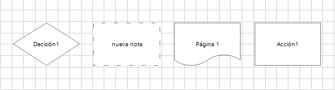
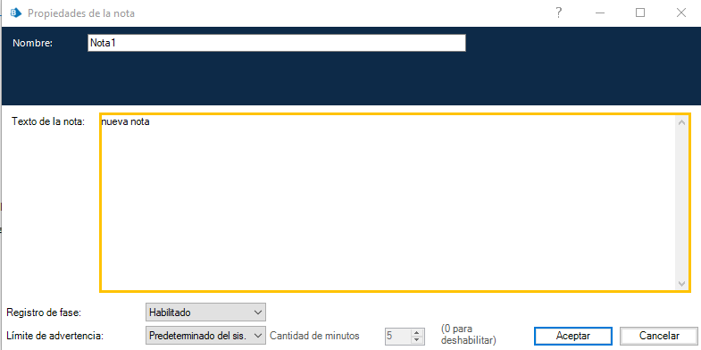
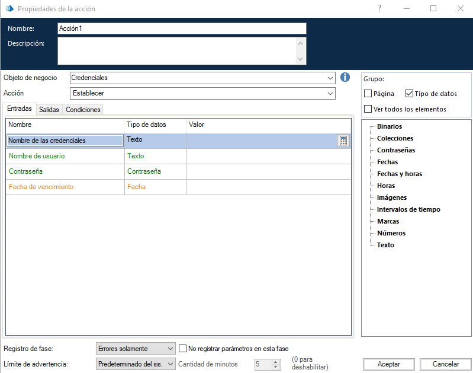
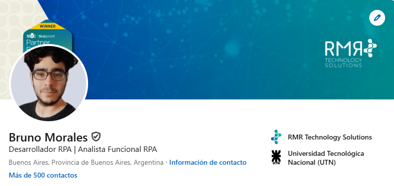

# Portafolio
---
En el siguiente repositorio se encuentra el código de mi portafolio.
La ídea general y el concepto detrás de este diseño, son los Stages de Blue Prism.

Los stages utilizados son los más genéricos dentro de Blue Prism, a fin de generar afinidad visual fácilmente y a su vez, no sea del todo engorroso para quien no está familiarizado con Blue Prism.

---
Ejemplo de Nota:

---
Ejemplo de Acción:

---
Este Portafolio, fue creado en Python con DJANGO, se utilizó Templates Jinja2 para poder generar cambios en la web con redirecciones.
Por último, se incluye código Javascript que permite el Switch de datos entre clicks a lo largo de las distintas vistas.

Gracias por pasarte!

En caso de querer contactarme, visitar mi perfil de Linkedin: https://www.linkedin.com/in/bruno-morales-5247b1201/

